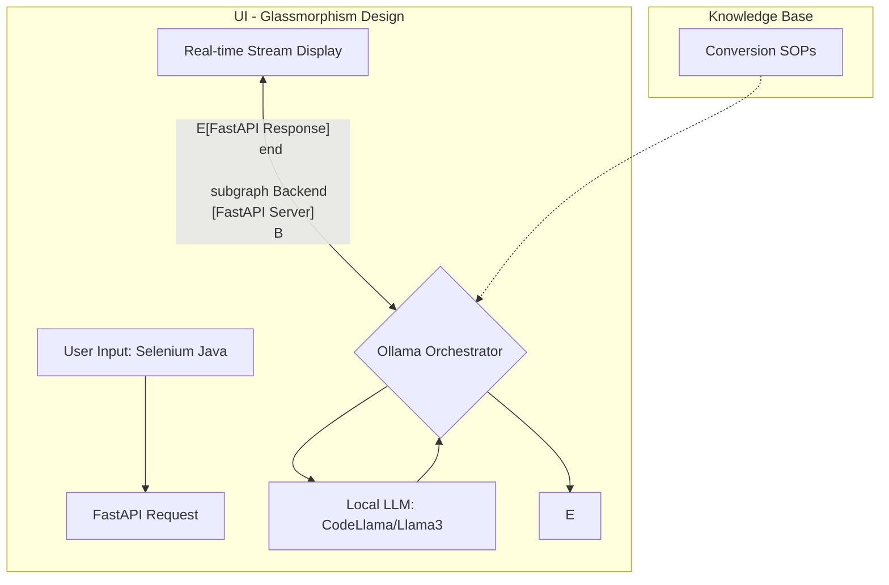

# 🚀 Blast Converter: Selenium to Playwright

Blast Converter is a premium, high-speed migration tool designed to transform legacy **Selenium Java (TestNG)** test suites into modern **Playwright (JavaScript/TypeScript)** code using the power of local LLMs.


## 🏗️ Architecture

The system follows a modern client-server architecture, leveraging the **B.L.A.S.T.** protocol for deterministic conversions.



### Conversion Flow:
1.  **Input:** User pastes Selenium Java code into the premium, glassmorphism-styled editor.
2.  **Request:** The frontend sends an asynchronous request to the FastAPI backend.
3.  **Processing:** The backend uses the **Ollama API** to process the code through a local LLM (e.g., `codellama`).
4.  **Logic:** Conversions are guided by the **Standard Operating Procedures (SOPs)** defined in `architecture/conversion_sop.md`.
5.  **Output:** The converted Playwright (JS/TS) code is streamed back to the frontend in real-time.

## ✨ Features

*   **Real-time Streaming:** Watch your code being converted in real-time via Server-Sent Events (SSE).
*   **Dual-Pane Editor:** Side-by-side comparison of Selenium vs. Playwright with syntax highlighting.
*   **Multi-Model Support:** Choose between `codellama`, `llama3.2`, or any model installed in your Ollama instance.
*   **Premium UI:** Modern dark-mode interface with Glassmorphism effects and Inter typography.
*   **Privacy First:** 100% Local. No data ever leaves your hardware.
*   **B.L.A.S.T Protocol:** Built using the Blueprint-Link-Architect-Stylize-Trigger methodology.

## 🛠️ Tech Stack

*   **Frontend:** Vanilla Javascript (ES6+), CSS3 (Custom Variables, Blur Effects), HTML5.
*   **Syntax Highlighting:** Prism.js for Java and TypeScript.
*   **Backend:** FastAPI (Python) with `httpx` for LLM orchestration.
*   **Intelligence:** Local LLM integration via Ollama.
*   **Architecture:** A.N.T. (Architecture, Navigation, Tools) 3-layer system.

## 🚀 Getting Started

### Prerequisites

1.  **Python 3.10+**
2.  **Ollama** (Installed and running)
3.  **Local Models:** 
    ```bash
    ollama pull codellama
    ollama pull llama3.2
    ```

### Installation

1.  Clone the repository:
    ```bash
    git clone https://github.com/nikhilverma1334/Project2-Selenium2PlaywrightConverter.git
    cd Project2-Selenium2PlaywrightConverter
    ```
2.  Install dependencies:
    ```bash
    pip install fastapi uvicorn httpx python-dotenv
    ```
3.  (Optional) Configure `.env`:
    ```env
    OLLAMA_BASE_URL=http://localhost:11434
    ```

### Running the App

1.  Start the backend server:
    ```bash
    python backend/main.py
    ```
2.  Open your browser to:
    `http://localhost:8000`

## 📂 Project Structure

*   `backend/main.py` - FastAPI server handling LLM logic and SSE streaming.
*   `backend/static/` - Frontend assets (Glassmorphism UI, logic, styles).
*   `architecture/` - Standard Operating Procedures for conversion logic.
*   `tools/` - Utility scripts for verification and manual conversion.
*   `converted_output/` - Default directory for saved conversion results.

## 📜 License

Project developed as part of the B.L.A.S.T Protocol. Built with Antigravity.
